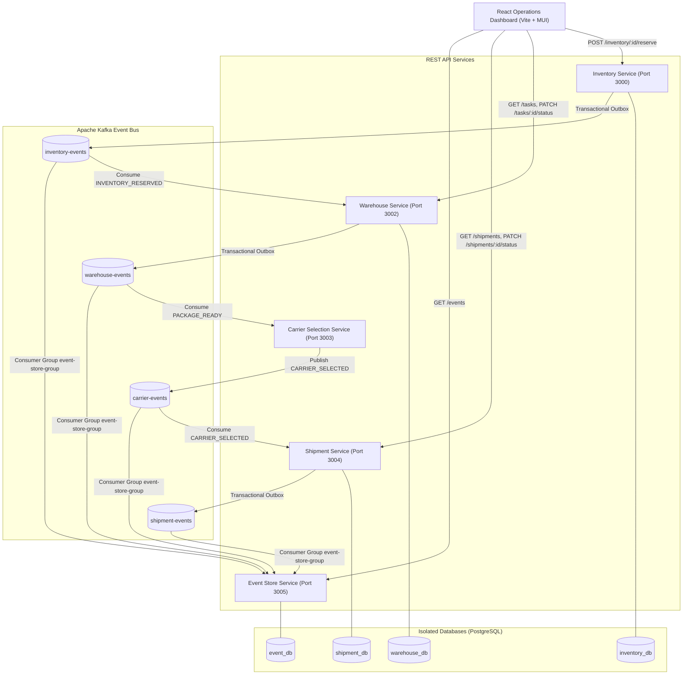

# Distributed Logistics Orchestration Platform

An event-driven logistics orchestration backend that coordinates inventory reservation, warehouse processing, deterministic carrier selection, and shipment lifecycle management using **Node.js, TypeScript, Express, PostgreSQL, Prisma, Apache Kafka, Docker Compose, and React**.

---

## 📌 Problem Statement

Modern e-commerce and logistics operations involve multiple physical warehouses, inventory locations, shipping carriers, and delivery stages. Coordinating dependent operations reliably across physical locations without tight service coupling, duplicate processing, or silent message loss is a major distributed systems challenge.

This platform solves cross-service coordination by implementing **asynchronous event-driven workflows, transactional outbox patterns, idempotent consumers, state machines, and isolated databases**.

---

## 🏗️ Architecture



---

## 🔄 End-to-End Workflow

```text
Dashboard (Reserve Stock)
      │
      │ POST /inventory/:id/reserve
      ▼
Inventory Service (PostgreSQL ACID Transaction + Outbox Record)
      │
      │ Kafka Event: INVENTORY_RESERVED (Partition Key: inventoryId)
      ▼
Warehouse Service (Idempotent Task Creation: PICKING_PENDING)
      │
      │ Operator advances: PICKING_PENDING → PICKED → PACKED → PACKAGE_READY
      │ (ACID Transaction + Outbox Record)
      ▼
Warehouse Kafka Event: PACKAGE_READY (Partition Key: taskId)
      │
      ▼
Carrier Selection Service (Evaluates weightKg, serviceLevel, priority)
      │
      │ Kafka Event: CARRIER_SELECTED (Partition Key: taskId)
      ▼
Shipment Service (Idempotent Shipment Creation + Outbox Record)
      │
      │ Status Lifecycle: CREATED → IN_TRANSIT → OUT_FOR_DELIVERY → DELIVERED
      ▼
Event Store Service (Consumes all events with fromBeginning: true)
      │
      ▼
React Dashboard Events & Live Feed (Periodic non-overlapping polling)
```

## Automation Modes

Every new inventory reservation includes an `automationMode`:

- `MANUAL` (default): the operator advances Warehouse tasks and Shipment statuses through the dashboard.
- `AUTONOMOUS`: backend workers advance Warehouse tasks from `PICKING_PENDING` to `PACKAGE_READY`, then advance Shipments from `CREATED` to `DELIVERED`.

The dashboard stores the selected mode in `localStorage`, but the mode is persisted with each workflow and propagated through Kafka. Carrier selection and shipment creation remain event-driven in both modes.

### Backend Automation Workers

- Warehouse Service polls eligible autonomous tasks using database status and `updatedAt`. It advances one state approximately every 2 seconds by default.
- Shipment Service polls eligible autonomous shipments using database status and `updatedAt`. It advances one state approximately every 5 seconds by default.
- Workers use atomic conditional transitions and database state, so manual/automated races are safe and in-progress workflows resume after a service restart.
- Polling dashboard views observe the real backend state; no workflow timing is simulated in React.

---

## 📦 Microservices Breakdown

| Service | Port | Database | Responsibilities |
| :--- | :--- | :--- | :--- |
| **Inventory Service** | `3000` | `inventory_db` | Product/Warehouse management, atomic stock reservation, `INVENTORY_RESERVED` outbox publishing. |
| **Warehouse Service** | `3002` | `warehouse_db` | Idempotent task creation, status state machine (`PICKING_PENDING` → `PACKAGE_READY`), `PACKAGE_READY` outbox publishing. |
| **Carrier Selection Service** | `3003` | None | Deterministic carrier evaluation engine (Delhivery, BlueDart, DTDC) using weight, SLA & priority. Emits `CARRIER_SELECTED`. |
| **Shipment Service** | `3004` | `shipment_db` | Idempotent shipment creation, tracking generation (`LOG-2026-XXXXXX`), sequential transition state machine, outbox events. |
| **Event Store Service** | `3005` | `event_db` | Observability event sink consuming all Kafka topics from beginning. Exposes `GET /events`. |
| **Operations Dashboard** | `5173` | None | React + Vite + MUI ops dashboard rendering real-time metrics, warehouse locations, and event timeline. |

---

## 📜 Kafka Event Contract

Every message adheres to a single versioned `EventEnvelope<T>`:

```typescript
interface EventEnvelope<T> {
  eventId: string;        // Unique Event UUID
  eventType: string;      // Domain event name
  version: number;        // Event schema version
  occurredAt: string;     // ISO-8601 timestamp
  source: string;         // Originating service name
  correlationId: string; // Workflow correlation trace ID
  causationId?: string;  // Parent event ID
  data: T;                // Event data payload
}
```

---

## 🌐 Public REST APIs

### Inventory Service (`http://localhost:3000`)
- `GET /products` — List products.
- `POST /products` — Create product (`name`, `sku`, `weightKg`).
- `GET /warehouses` — List warehouses (`id`, `name`, `location`).
- `POST /warehouses` — Create warehouse (`name`, `location`).
- `GET /inventory` — List stock records.
- `POST /inventory` — Create stock record (`productId`, `warehouseId`, `totalQuantity`).
- `POST /inventory/:id/reserve` — Reserve stock (`quantity`, `serviceLevel`, `automationMode` where mode is `MANUAL` or `AUTONOMOUS`).
- `GET /health` — Readiness health check.

### Warehouse Service (`http://localhost:3002`)
- `GET /tasks` — List warehouse tasks.
- `PATCH /tasks/:id/status` — Update task status (`PICKING_PENDING` → `PICKED` → `PACKED` → `PACKAGE_READY`).
- `GET /health` — Readiness health check.

### Carrier Selection Service (`http://localhost:3003`)
- `GET /health` — Readiness health check.

### Shipment Service (`http://localhost:3004`)
- `GET /shipments` — List shipments.
- `GET /shipments/:trackingNumber` — Fetch shipment details.
- `PATCH /shipments/:trackingNumber/status` — Update shipment status (`CREATED` → `IN_TRANSIT` → `OUT_FOR_DELIVERY` → `DELIVERED`).
- `GET /health` — Readiness health check.

### Event Store Service (`http://localhost:3005`)
- `GET /events` — Query event log stream (`limit`, `eventType`, `source`, `correlationId`).
- `GET /health` — Readiness health check.

---

## 🚀 Running with Docker Compose (One-Command Setup)

1. **Clone & Launch Infrastructure & Microservices**:
   ```bash
   git clone https://github.com/preetisonule/logistics-orchestration-platform.git
   cd logistics-orchestration-platform
   docker compose up -d --build
   ```

2. **Verify Service Health**:
   ```bash
   docker compose ps
   ```

3. **Seed Demo Stock & Products**:
   ```bash
   node scripts/seed-demo.mjs
   ```

   Select `MANUAL` or `AUTONOMOUS` in the dashboard before reserving inventory. The selected mode applies to workflows started after the selection.

4. **Launch Operations Dashboard**:
   ```bash
   cd dashboard
   npm install
   npm run dev
   ```
   Access the dashboard at `http://localhost:5173`.

---

## 🧪 Running Tests

Run automated unit and business rule tests across all services:

```bash
cd inventory-service && npm test
cd warehouse-service && npm test
cd carrier-selection-service && npm test
cd shipment-service && npm test
cd event-service && npm test
```

---

## 💡 Key Architectural Decisions

1. **Why Kafka?**
   Asynchronous event streaming decoupled processing velocity between stock reservation and warehouse physical operations. Services operate independently without runtime availability dependencies.

2. **Why Transactional Outbox?**
   Directly emitting Kafka events inside HTTP request handlers causes dual-write inconsistencies if DB commits succeed but Kafka emits fail. Writing state changes and `OutboxEvent` records inside a single SQL transaction guarantees **at-least-once** event publishing.

3. **Why Idempotent Consumers?**
   Kafka at-least-once delivery can produce duplicate messages. Each consumer checks event `sourceEventId` or `taskId` against database unique constraints to safely discard duplicate events without data corruption.

4. **Why Separate Service Databases?**
   Database-per-service isolation prevents illegal cross-service SQL joins and preserves microservice encapsulation.

5. **Why Polling over WebSockets?**
   Lightweight 4–8 second non-overlapping HTTP polling eliminates complex WebSocket server connection state while satisfying operational monitoring requirements.

---

## ⚠️ Current Limitations

- Carrier API calls and driver assignments are simulated deterministic rule engines.
- Package location tracking is updated manually via operational status transitions.
- Autonomous fulfillment is a deterministic demonstration workflow; its delays are configurable through the Warehouse and Shipment service environment variables.
- Authentication and external OAuth gateways are omitted to focus on distributed system principles.
