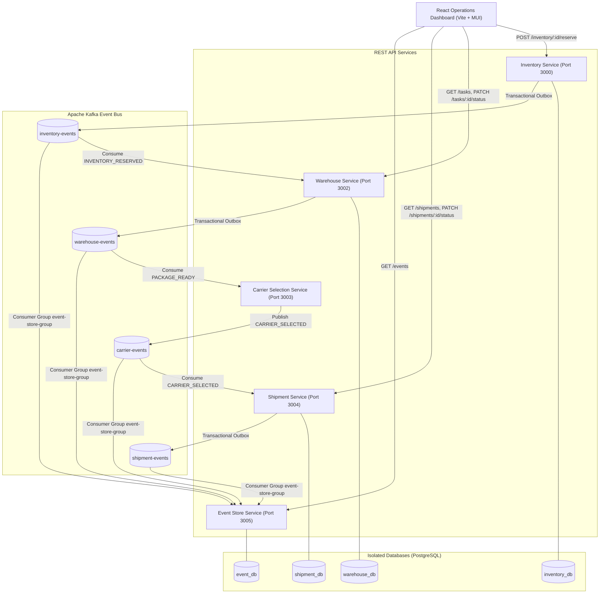

# System Architecture

## Architecture Diagram

## Microservice Boundaries

1. **Inventory Service** (`port: 3000`, `db: inventory_db`)
   - Manages Product, Warehouse, and Stock Inventory records.
   - Enforces stock reservation invariants (`available = total - reserved`).
   - Emits `INVENTORY_RESERVED` events via Transactional Outbox.

2. **Warehouse Service** (`port: 3002`, `db: warehouse_db`)
   - Consumes `INVENTORY_RESERVED` idempotently using `sourceEventId`.
   - Manages task lifecycle (`PICKING_PENDING` → `PICKED` → `PACKED` → `PACKAGE_READY`).
   - Emits `PACKAGE_READY` events via Transactional Outbox.

3. **Carrier Selection Service** (`port: 3003`)
   - Evaluates eligible carriers (Delhivery, BlueDart, DTDC) using weight, SLA, and deterministic priority.
   - Consumes `PACKAGE_READY` and emits `CARRIER_SELECTED` with `selectionReason`.

4. **Shipment Service** (`port: 3004`, `db: shipment_db`)
   - Consumes `CARRIER_SELECTED` idempotently using `taskId` and `sourceEventId`.
   - Generates unique tracking numbers (`LOG-2026-XXXXXX`).
   - Enforces sequential status state machine (`CREATED` → `IN_TRANSIT` → `OUT_FOR_DELIVERY` → `DELIVERED`).
   - Emits `SHIPMENT_CREATED` and `SHIPMENT_STATUS_UPDATED` via Transactional Outbox.

5. **Event Store Service** (`port: 3005`, `db: event_db`)
   - Observability service consuming all Kafka topics with `fromBeginning: true`.
   - Idempotently logs events and exposes `GET /events` REST endpoint for UI tracing.
